# Olist E-commerce анализ
Репозиторий представляет анализ данных бразильского маркетплейса Olist, целью которого была разведка, сбор основных метрик, выявление точек роста, оптимизация логистики и понимание поведения покупателей
## О проекте 
- Публичный датасет бразильской E-commerce площадки. Содержит в себе ~100к заказов, ~90k уникальных клиентов и тд.

- Суммарно датасет содержит ~40 таблиц с полными данными о заказах, доставке, местположении покупателей (не включая личные данные) и пр.

- В анализе рассмотрен период работы площадки с 01-01-2017 по 31-08-2018. Начальные и последние месяцы, содержащиеся в датасете были исключены, так как содержат в себе неполные данные.

**Ниже, представлена ER-диаграмма датасета Olist**


## Бизнес-вопросы исследования

### Логистика и доставка
1. Какие штаты Бразилии имеют самые быстрые/медленные сроки доставки, и как это коррелирует с географией штатов?
2. Являются ли аномально долгие доставки техническими ошибками или же это реальные кейсы? 
3. Влияет ли время доставки на итоговую оценку покупателя? Если да — насколько критично?
4. Какой срок доставки является критическим, после чего пользователи начинают терять лояльность?
5. Как ведет себя система доставки в периоды пикового спроса?

### Бизнес-метрики
6. Как менялась выручка (GMV), средний чек (AOV) и доход на клиента (ARPU) в течение анализируемого периода по месяцам и кварталам? 
7. Как ведут себя самые нестабильные категории? Какие из них наиболее рискованные? 
8. Какие категории стали наиболее успешными в 2017 и 2018 году
9. Склонны ли клиенты совершать повторные заказы или преобладает модель разовых покупок?
10. Соответствует ли качество логистики географическому распределению выручки? Поиск критических точек потери дохода

### Общие выводы и рекомендации
11. Какие выводы о работе компании можно сделать? Какие рекомендации по развитию можно дать бизнесу?

## Подготовка данных
Перед тем, как перейти к анализу, данные были собраны в единый датафрейм, очищены и подготовлены для дальнейших рассчетов. Это критически важно, так как всегда необходимо пользоваться простым правилом "Мусор на входе" -> "Мусор на выходе"
### Источники данных:
- **Датасет** - [Olist Brazilian E-Commerce (Kaggle)](https://www.kaggle.com/datasets/olistbr/brazilian-ecommerce)
### Что было сделано

| Шаг | Что делали | Зачем | Результат |
|-----|-----------|-------|-----------|
| **Загрузка** | Считали 8 CSV-файлов через `pandas.read_csv()` | Собрать исходные данные в рабочую среду | 8 датафреймов, готовых к обработке |
| **Типы данных** | Привели даты к `datetime`, числовые поля к `float/int` | Корректные расчёты и фильтрация по времени | Все временные колонки в едином формате |
| **Пропуски** | Заполнили `NaN` в категориальных полях на `'unknown'`, числовые — медианой | Не терять строки, но избежать искажений | Потеряно <1% строк из-за критических пропусков |
| **Дубликаты** | Удалили полные дубли в cтроковых столбцах | Исключить повторный учёт заказов | Данные о заказах и признаках товаров не дублируют друг друга |
| **Флаги** | Создали `is_delivered`, `conf_&paid`, `confirm` | Отфильтровать «битые» записи | Чистый датасет только с завершёнными заказами |
| **Фильтрация** | Исключили недоставленные заказы (~3%), нулевые платежи | Анализировать только релевантные данные | Датасет содержит только релевантные данные, готовые для анализа |
| **Объединение** | Связали таблицы через `order_id`, `customer_id`, `product_id` и пр. | Получить единую таблицу для анализа | Датафрейм с 43 колонками и 92247 строками|
|Сохранение полученного датафрейма и удаление технических флагов|Удалили технические флаги `is_delivered`, `conf_&paid`, `confirm` |Оптимизация датафрейма и удаление ненужных столбцо |Датафрейм больше не имеет технических флагов|
|Ограничили период с 01-01-2017 по 31-08-2018|С помощью булевой маски данные были ограничены временным интервалом|Начальные и конечные месяцы датасета содержат неполные данные, которые потенциально ломают результаты|Датафрейм содержиn месяцы только с полной информацией, имеет 89808 строк и готов к анализу|

### Приведенный скрипт отражает, что датасет готов к работе и мы можем приступить к анализу
```python
critical_cols = [
    'order_id', 'order_purchase_timestamp', 
    'order_delivered_customer_date', 'delivery_days', 
    'payment_value', 'review_score', 'customer_unique_id'
]

print("!Отчет о пригодности датасета!\n")
     
    # 1. Проверка на пустые значения в критических полях
null_report = data[critical_cols].isnull().sum()
if null_report.sum() == 0:
    print("Пропуски в критических данных отсутствуют")
else:
    print("Найдены пропуски в критических полях")
    print(null_report[null_report > 0])

    # 2. Проверка логики доставки
negative_days = (data['delivery_days'] < 0).sum()
if negative_days == 0:
    print("Аномальной доставки нет")
else:
    print(f"Ошибка: Найдено {negative_days} строк, где доставка раньше заказа!")

    # 3. Финансовая целостность
if data['payment_value'].min() >= 0:
    print("Отрицательных сумм платежей не обнаружено")

    # 4. Итоговый статус
print()
print(f"Итого: {data.shape[0]} чистых строк готовы к анализу")
```
```text
!Отчет о пригодности датасета!

Пропуски в критических данных отсутствуют
Аномальной доставки нет
Отрицательных сумм платежей не обнаружено

Итого: 89808 чистых строк готовы к анализу
```
## Ответы на бизнес-вопросы 

### №1 Какие штаты Бразилии имеют самые быстрые/Медленные сроки доставки, и как это коррелирует с географией штатов?

В процессе анализа было выявлено ТОП-10 штатов с самой быстрой и стабильной доставкой среди всех штатов Бразилии.


**Тут должна быть картинка с картой бразилии из риск анализа**

- Штат Сан-Паулу (SP) показывает самую быструю доставку (в 1.5 раза быстрее средней по стране). В ТОП-10 входят преимущественно южные и центрально-западные штаты (PR, MG, DF, RJ).
- Аутсайдеры: Худшие показатели у северных штатов, лидер по задержкам — Амапа (AP) (среднее время ~20 дней, 10% заказов доставляются дольше месяца).
- Максимальное время доставки 209 дней. Такая задержка произошла в штате: !!!!!! и требует отдельного рассмотрения причин
- Инсайт: Скорость доставки имеет прямую корреляцию с экономической развитостью региона. Юг и Центр обладают развитой инфраструктурой и высокой плотностью складов, в то время как Север ограничен сложной географией и слабой логистической связностью.

### №2 Являются ли аномально долгие доставки техническими ошибками или же это реальные кейсы?

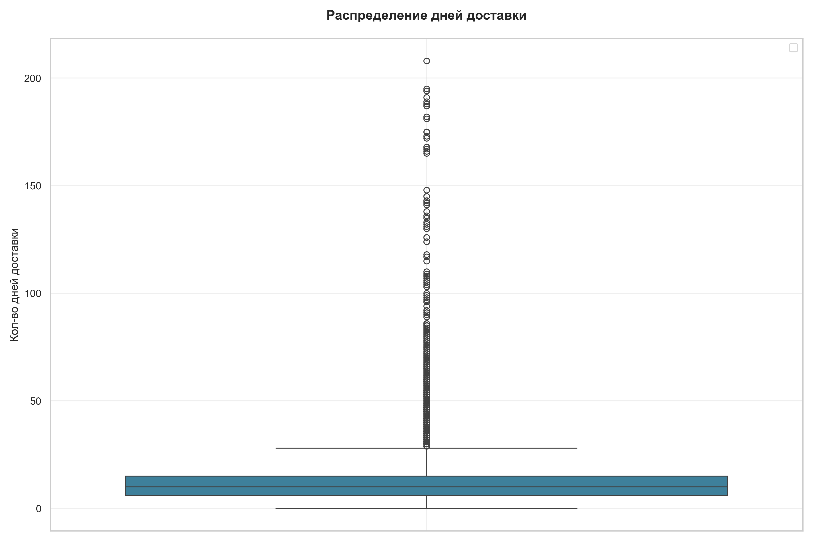

- Данные имеют 4.91% доставок, продолжительность которой была аномально долгой (Более 30 дней)
- Визуализация подтверждает, что компания, несмотря на проблемы, имеет отлаженную логистическую структуру, доставка основной массы заказов сосредоточена на промежутке от 10 до 30 дней.
- Проверка этапов жизненного цикла показала, что площадка передает заказ в доставку, в среднем, очень быстро (~ 1 дня), больше всего задержек происходит на последнем этапе доставки, когда заказ нужно передать клиенту
- Среднее время доставки аномальных заказов составляет 32 дня, при стандартном отклонении 18 дней, что означает полную непредсказуемость сроков доставки
- Наибольшее количество выбросов наблюдается в развитых штатах, Сан-Паулу и Рио-Де-Жанейро. Это говорит о том, что экстремальные задержки в доставке не связаны с удаленностью регионов, а связана с проблемами логистической системы и её работы. 
- Средняя оценка аномальных заказов - 2.34, что почти в два раза ниже. Экстремально долгая задержка неразрывно связана с потерей лояльности клиентов
- **Вывод:** Выбросы не являются техническими ошибками или ошибками данных, а являются реальными логистическими провалами 

### №3 Влияет ли время доставки на итоговую оценку покупателя? Если да — насколько критично?

Для ответа на поставленный вопрос был проведен корреляционный анализ

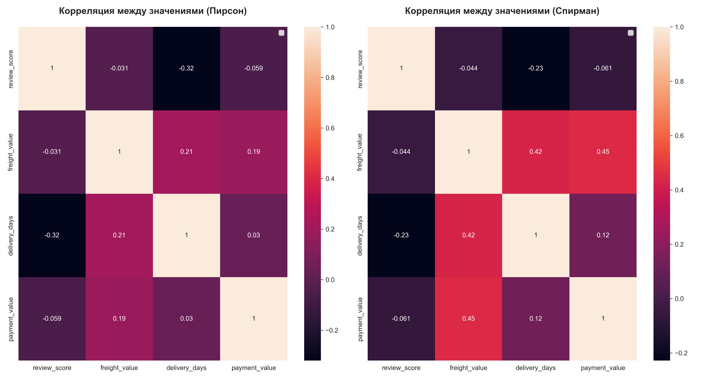

```python
from scipy.stats import pearsonr, spearmanr
    #Посчитаем коэффициент корреляции Пирсона и Спирмена
pearson_r, pearson_p = pearsonr(corr_data['delivery_days'], corr_data['review_score'])
spearman_r, spearman_p = spearmanr(corr_data['delivery_days'], corr_data['review_score'])

# Выведем результат для наглядного сравнения
print('=Сравнение взаимосвязи между количеством дней доставки и конечной оценкой пользователя. Разница между Пирсоном и Спирменом=\n')
print(f"Коэффициент корреляции (КК) Пирсона: {pearson_r:.2f}, p_value (Пирсон): {pearson_p:.3e}")
print(f"Коэффициент корреляции (КК) Спирмана: {spearman_r:.2f}, p_value (Пирсон): {spearman_p:.3e}\n")
print(f"Разнциа между КК Пирсона и Спирмана: {abs(pearson_r - spearman_r):.2f}")
```
```text
=Сравнение взаимосвязи между количеством дней доставки и конечной оценкой пользователя. Разница между Пирсоном и Спирменом=

Коэффициент корреляции (КК) Пирсона: -0.32, p_value (Пирсон): 0.000e+00
Коэффициент корреляции (КК) Спирмана: -0.23, p_value (Пирсон): 0.000e+00

Разнциа между КК Пирсона и Спирмана: 0.09
```

- Наблюдается умеренная отрицательная корреляция. При рассчете по методу Пирсона -0.32, по методу Спирмена -0.23, что говорит о умеренной отрицательной корреляции. Значение корреляции Пирсона может быть выше благодаря выбросам, которые находятся в данных, поэтому значение Пирсона необходимо интерпретировать с осторожностью, предпочтительно опираться на корреляцию Спирмена

-  Предельно малое p_value позволяет утверждать, что корреляция между временем доставки и итоговой оценкой покупателя статистически значима

- Можно с уверенностью утверждать, что время доставки влияет на итоговую оценку и может являться одним из сильнейших рычагов управления рейтингом покупателя и между ними существует умеренная отрицательная корреляция. 

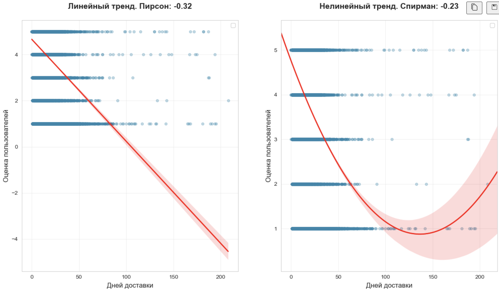

- Визуализация результатов распределения оценок в зависимости от дней доставки доказывает, что чем дольше длится доставка, тем сильнее падает конечная оценка пользователей. При этом нелинейный тренд показывает, что оценки падают неравномерно
- Можно сделать вывод, что критическое время доставки - до 30 - 50 дней, после чего оценки заказов начинают резко снижаться
- Период после 120 дней имеет большой доверительный интервал, что говорит о том, что экстремально долгие доставки очень редки и не являются закономерностью. Положительное направление графика объясняется артефактами модели, так как данных мало. Ни в коем случае нельзя делать вывод о том, что клиенты при такой долгой доставке становятся довольнее

Для понимания того, насколько сильно каждый день задержки влияет на оценку пользователя была построена регрессионная модель

```text
                            OLS Regression Results                            
==============================================================================
Dep. Variable:             mean_score   R-squared:                       0.171
Model:                            OLS   Adj. R-squared:                  0.159
Method:                 Least Squares   F-statistic:                     14.83
Date:                Wed, 15 Apr 2026   Prob (F-statistic):           0.000252
Time:                        17:45:20   Log-Likelihood:                -16.947
No. Observations:                  74   AIC:                             37.89
Df Residuals:                      72   BIC:                             42.50
Df Model:                           1                                         
Covariance Type:            nonrobust                                         
===================================================================================
                      coef    std err          t      P>|t|      [0.025      0.975]
-----------------------------------------------------------------------------------
const               4.7333      0.172     27.596      0.000       4.391       5.075
median_delivery    -0.0682      0.018     -3.852      0.000      -0.103      -0.033
==============================================================================
Omnibus:                       31.702   Durbin-Watson:                   2.035
Prob(Omnibus):                  0.000   Jarque-Bera (JB):               80.129
Skew:                          -1.377   Prob(JB):                     3.98e-18
Kurtosis:                       7.290   Cond. No.                         46.8
==============================================================================
```
- При помощи регрессионной модели было выяснено, что каждый день задержки снижает оценку на 0.0682. Это достаточно много, так как доставка заказа за 30 дней может обрушить оценку с 4.7 до 2.7, что для маркетплейса, обычно, означает потерю клиента.
- Модель статистически значима и данные не могли быть получены случайным образом ( P>|t| = 0.00)
- Время доставки объясняет около 17% колебаний оценки (R-squared = 0.171). Остальные 83% - это прочие факторы, такие как качество товара, упаковка и прочее, что доказывает, что на конечную оценку пользователя влияет не только скорость доставки, но и другие факторы, хотя 17% для единственного фактора - высокий показатель, что делает скорость доставки критичным для оценки фактором.

### №4 Какой срок доставки является критическим, после чего пользователи начинают  значительно терять лояльность?


На основе динамики средних оценок был определен критический порог — 30 дней. После этой отметки наблюдается резкое снижение потребительской лояльности:

- Падение ниже целевого уровня: До 30 дней средняя оценка держится в районе 4-4.5 баллов. После преодоления этого срока график и разброс значений почти никогда не возвращаются к отметке 4.0, которая считается индикатором удовлетворенности.
- Контекст среднего значения: Общее среднее по выборке (4.13) подтверждает, что даже при быстрой доставке покупатели не всегда ставят высший балл. Это подчеркивает, что логистика — важный, но не единственный драйвер оценки.
- Ограничения анализа: Умеренная отрицательная корреляция указывает на связь, но не доказывает прямую причинность. На финальный рейтинг влияют сопутствующие факторы: качество упаковки, цена товара и даже субъективное настроение клиента.
- Итог: Срок в 30 дней является психологическим барьером для пользователей. Превышение этого лимита гарантированно переводит заказ в категорию «неудовлетворительных» (ниже 4 звёзд).

### №5 Как ведет себя система доставки в периоды пикового спроса?
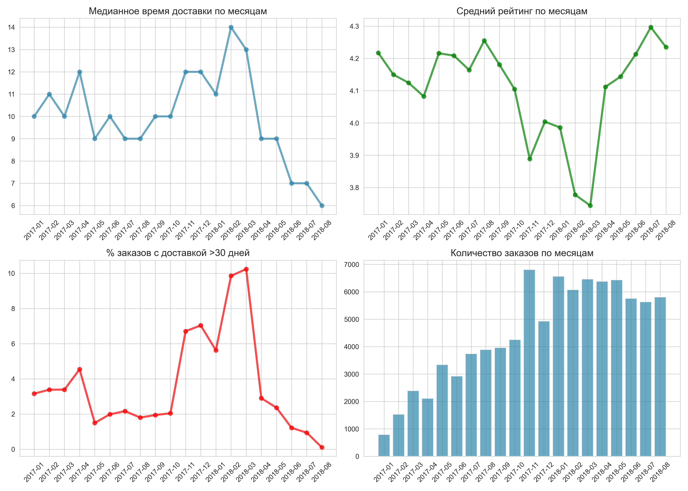
- В ноябре 2017 произошел взрывной рост заказов из-за чего не справилась и начала накапливать кумулятивный эффект, который вылился в масштабный сбой логистической системы, когда медианное время доставки возросло до 14 дней, доля заказов, доставляемых более 30 дней выросла до 10%, а средний рейтинг упал до 3.7
- Исходя из графиков, система логистики достаточно долго копила в себе проблемы и не могла масштабироваться соразмерно бизнесу. Об этом свидетельствует плавный рост медианного времени доставки и количества заказов, доставляемых более 30 дней. При этом средние оценки пользователей плавно падали, соразмерно росту задержек в доставке.
- В марте 2018 года компания внедрила решение и успешно масштабировала логистическую систему, после чего медианное время доставки и доля задерженных заказов начали резко сокращаться. При этом средний рейтинг заказов начала также соразмерно расти с небольшой задержкой во времени
- Данный вопрос еще раз доказывает влияние времени доставки на рейтинги заказов. Бизнесу критически важно развивать логистическую системы для поддержания и увеличения лояльности клиентов

### №6 Как менялась выручка (GMV), средний чек (AOV) и доход на клиента (ARPU) в течение анализируемого периода по месяцам и кварталам? 
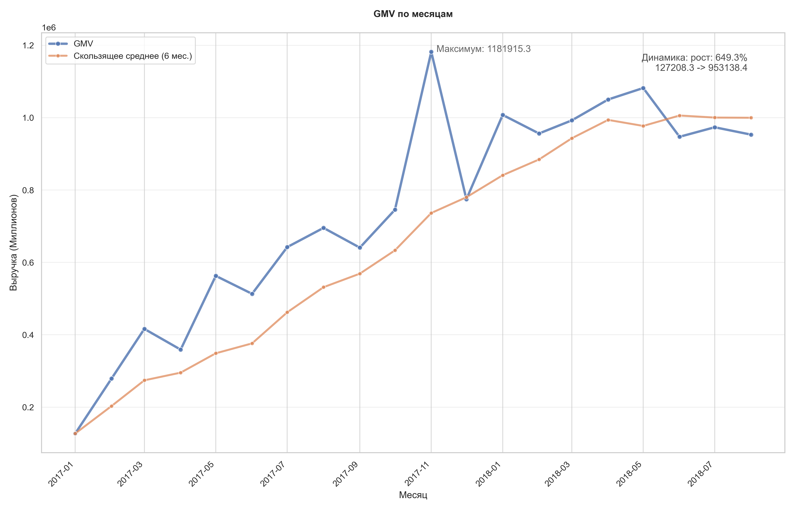
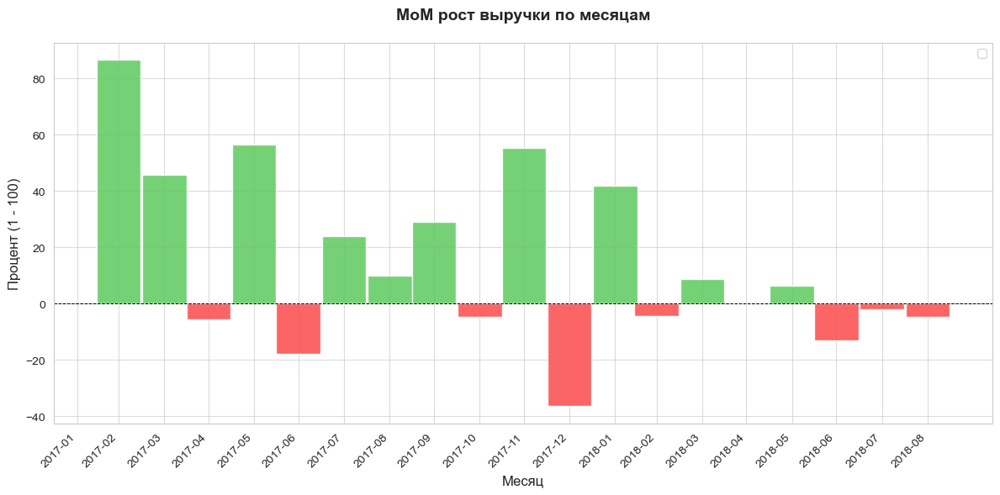
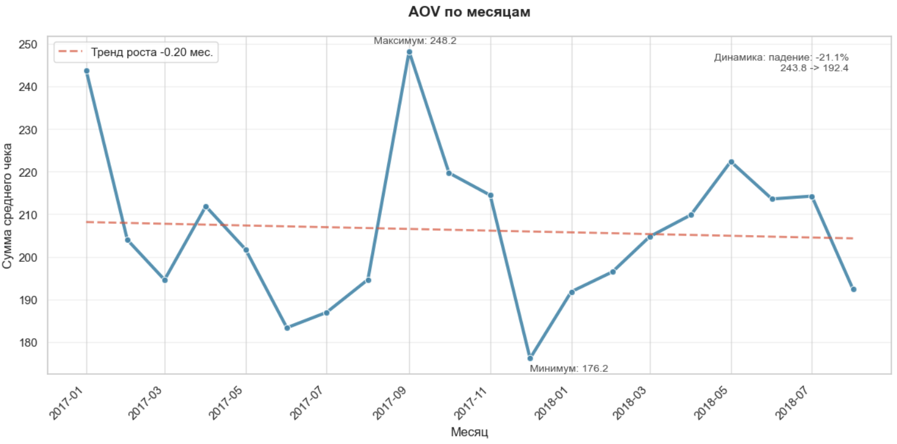
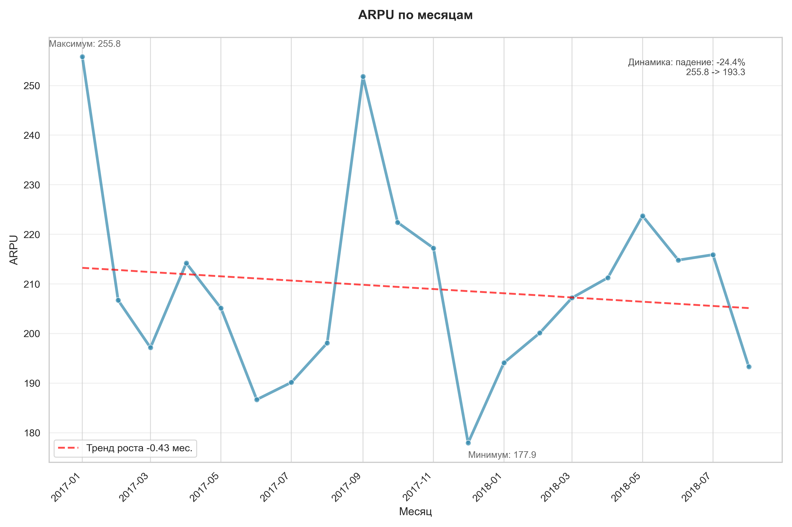

- Общая выручка за весь период выросла в 10 раз, при этом графики AOV и ARPU показвают, что рост был "некачественным" и имеют отрицательный тренд (-21% и -24%), что говорит о том, что каждый новый привлеченный клиент с течением времени приносит все меньше и меньше денег несмотря на волатильность
- В сентябре - ноябре 2017 года произошел пиковый рост среднего чека и ценности клиента. В данный момент могло быть, как повышение цен на самой площадке, так и привлечение более доходной аудитории. Тем не менее, провал логистической системы мог испортить пользовательский опыт покупателей, о чем может свидетельствовать резкий спад среднего чека и ценности клиента в последующие месяцы
- В январе 2018 года наблюдаются минимальные показатели AOV, ARPU, а также падение выручки, что может быть как следствием того, что люди закономерно меньше тратят после масштабных акций, так и потеря лоьльности клиентов после масштабных проблем в логистике, в следствие чего клиенты начали тратить меньше
- В последующие месяцы 2018 года показатели выручки восстановились, но AOV и ARPU так и остались на низком уровне, что свидетельствует о том, что площадка начала больше зарабатывать на притоке огромного количество новых покупателей и работать в более дешевом сегменте

**Общие выводы по графикам**

Динамика выручки (GMV) вводит в заблуждение: за взрывным ростом оборота скрывается деградация доходности на одного клиента (ARPU -24%). Кризис логистики в конце 2017 года стал переломным моментом: он, возможно, испортил опыт самым ценным клиентам, из-за чего компания была вынуждена перейти на модель низкого среднего чека. Для устойчивого развития бизнесу необходимо не просто наращивать базу, а работать над удержанием (Retention) и возвращением к высокому среднему чеку, а также повышать ценность каждого клиента, иначе стоимость привлечения клиента (CAC) в будущем может превысить доход от него.

### №7 Как ведут себя самые нестабильные категории? Какие из них наиболее рискованные?


- Самая рискованная категория - "Стационарные телефоны" (telefonia fixa), она имеет очень высокий показатель волатильности (>0.5) и несмотря на высокий средний чек (~1500) на эту категорию нельзя полагаться и адекватно учитывать её при планировании бюджета, так как эта категория ведет себя максимально непредсказуемо
- Также, выделяется категория "Сельское хозяйство" (agro_industria_e_comercio), она имеет несколько меньший показатель коэффициента вариации (Около 0.2) при этом имеет достаточно высокий средний чек (800). Небольшая общая выручка категории говорит о том, что заказы в ней редкие и любой срыв может сильно ударить по финансовым показателям месяца
- Самой перспективной категории, среди представленных на диаграмме является "Компьютеры" (pcs), она имеет высокую выручку и при этом низкую волатильность (<0.1) и высокий средний чек. Эта категория является очень перспективной для развития, так как товары в ней дорогие и пользуются стабильным спросом

### №8 Какие категории показали наибольший рост в 2017 году по сравнению с 2018-м?

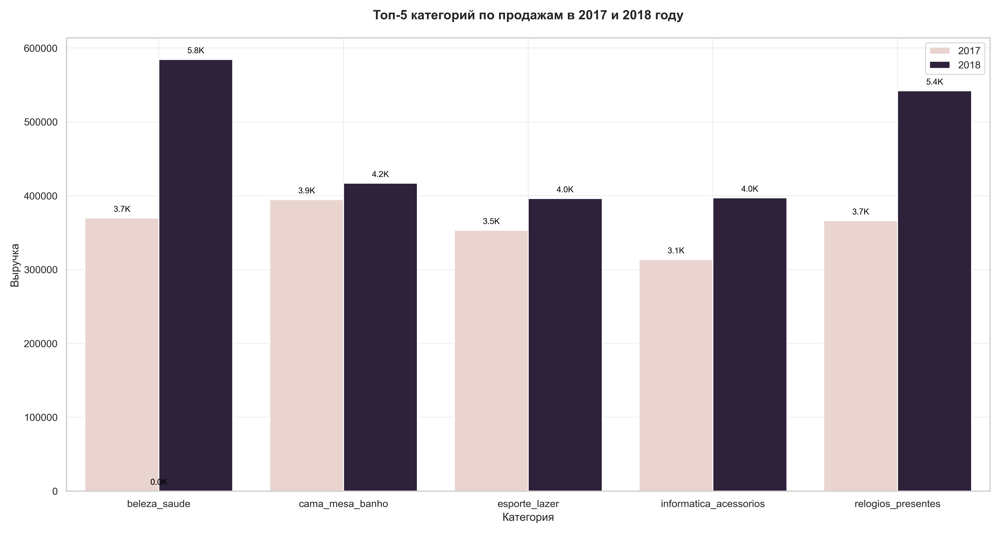
- Абсолютным лидером по росту стала категория "Красота и здоровье" (beleza saude) - она показала впечталяющий рост (с 3.7К до 5.8К) и стала самой прибыльной категорией 2018 года

- Также, впечатляющий рост показала категория "Часы и подарки" (relogios_presentes), которая показала уверенный рост и закрепилась на втором мессте по прибыльности в 2018 году

- Остальные представленные категории также показали уверенный, но не взрывной рост, что говорит о том, что несмотря на проблемы с доставкой, пользовательским опытом некоторых клиентов, площадка продолжает уверенно развивать свои топовые категории.

### №9 Склонны ли клиенты совершать повторные заказы или преобладает модель разовых покупок?
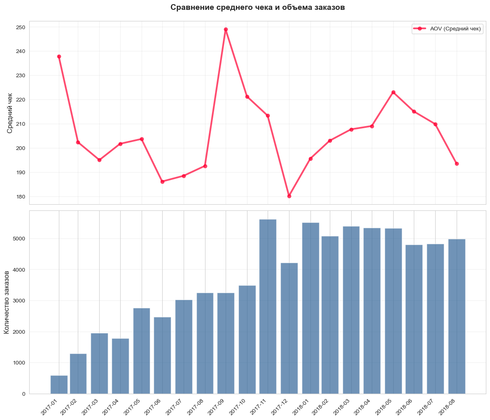
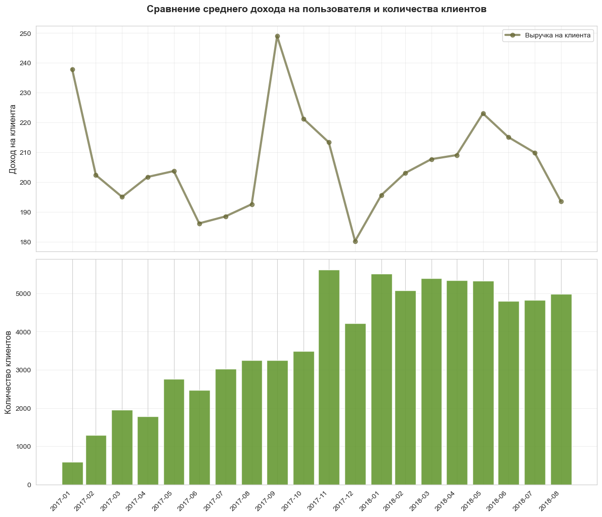

- AOV и ARPU примерно равны, что говорит о том, что один клиент делает в среднем один заказ, после чего уходит. Площадка привлекает, но не удерживает клиентов. В ином случае показатель ARPU были бы выше среднего чека.
- Компания тратит большие ресурсы на привлечение новых клиентов, что приводит к их взрывному росту осенью 2017 года. При этом, как только активный приток новых клиентов падает, ценность клиента также падает, так как площадка плохо сформировала лояльную клиентскую базу
- В хорошем случае, со временем график ARPU должен расти, так как площадка накапливает лояльную базу клиентов, которые наслаиваются на новых клиентов. В данном случае мы имеем отрицательный тренд, что говорит о том, что каждый клиент совершает покупку и приносит все меньше денег

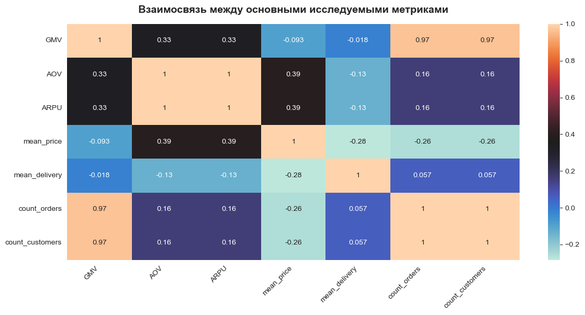

- Математическим подтверждением преобладания разовых покупок служит идеальная корреляция (1.0) между средним чеком (AOV) и доходом на одного клиента (ARPU) на тепловой карте. Это доказывает, что подавляющее большинство пользователей совершает лишь одну транзакцию за всё время, и ценность клиента для бизнеса ограничена рамками одного чека


### №10 Соответствует ли качество логистики географическому распределению выручки? Поиск критических точек потери дохода
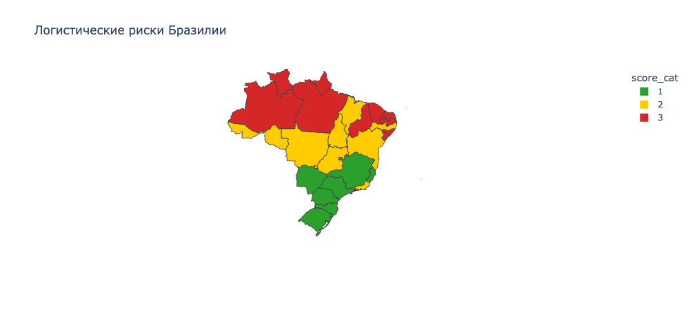
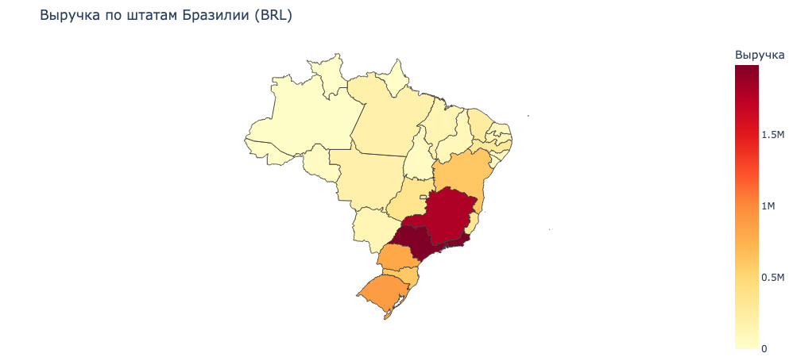

-География логистики соответствует географии текущей выручки, но при этом ограничивает потеницал роста площадки
- Основная выручка концетрируется в зеленых зонах, на юге и юго-западе (Около 80% выручки) однако центральные и северные регионы остаются проблемной зоной, так как логистика в них страдает, при том, что выручки в них могут выходить до 1 миллиона.
- Точкой, в которой площадка теряет прибыль, можно назвать северные штаты, находящиеся в красной зоне. Компания не теряет значительную часть прибыли, но при этом не может эффективно расшириться вглубь страны из-за значительных логистических рисков и издержек, засчет чего, как раз таки и теряет потеницальную прибыль.


