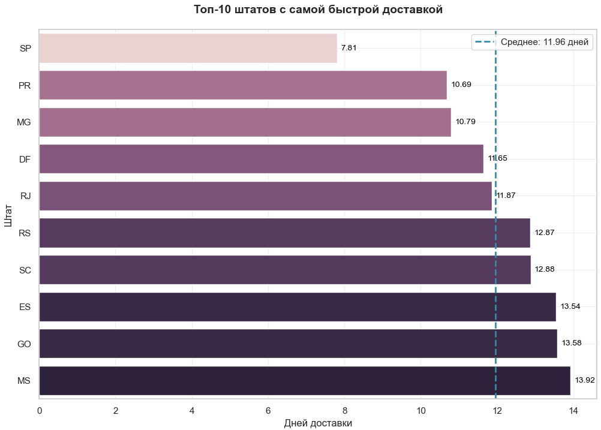
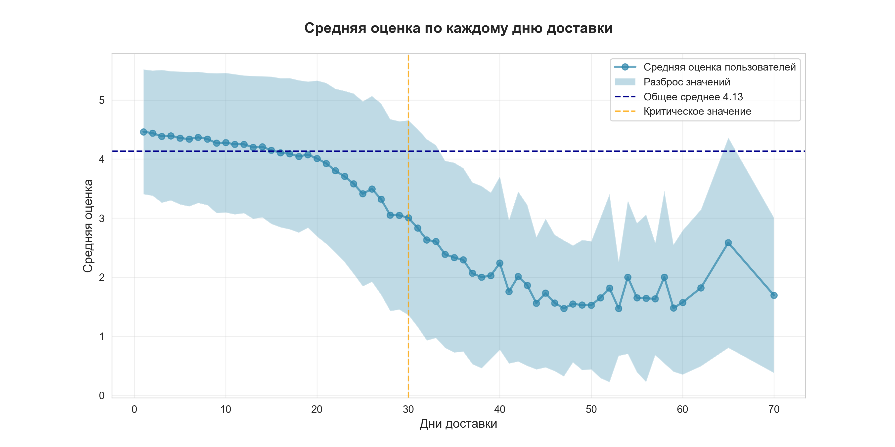

# Olist E-commerce анализ
Репозиторий представляет анализ данных бразильского маркетплейса Olist, целью которого была разведка, сбор основных метрик, выявление точек роста, оптимизация логистики и понимание поведения покупателей
## О проекте 
- Публичный датасет бразильской E-commerce площадки. Содержит в себе ~100к заказов, ~90k уникальных клиентов и тд.

- Суммарно датасет содержит ~40 таблиц с полными данными о заказах, доставке, местположении покупателей (не включая личные данные) и пр.

- В анализе рассмотрен период работы площадки с 01-01-2017 по 31-08-2018. Начальные и последние месяцы, содержащиеся в датасете были исключены, так как содержат в себе неполные данные.

**Ниже, представлена ER-диаграмма датасета Olist**


## Что было исследовано
- Насколько успешно растет выручка площадка?

- Из чего складывается выручка компании и насколько велика ценность каждого клиента? (Рассчет метрик AOV и ARPU)

- Какие категории были наиболее успешны в 2017 и 2018 годах?

- Анализ срежнего чека и волатилльности по категориям

- Анализ доставки: какое количество заказов от общего числа было отменено? Какое количество выбросов в доставке, среди общего числа завершенных доставок?

- Какой средний срок доставки? Составление краткой описательной статистики доставки

- Анализ выбросов и выявление причин критических задержек в доставке

- Анализ по штатам: Составление топа штатов с самой быстрой доставкой по стране

- Риск-анализ по штатам. Составление карты логичстических рисков.

- Корреляционный анализ: Выяснить взаимосвязь между длительностью доставки и конечной оценкой пользователя. Оценить полученную корреляцию (p_value)

- Элементы простого регрессионого анализа: Выяснить, насколько 1 день доставки в среднем снижает конечную оценку пользователя. Оценить построенную модель

- Составить общие выводы по проведенному исследованию и бизнес-рекомендации площадке

## Бизнес-вопросы исследования

### Логистика и доставка
1. Какие штаты Бразилии имеют самые быстрые/медленные сроки доставки, и как это коррелирует с географией штатов?
2. Влияет ли время доставки на итоговую оценку покупателя? Если да — насколько критично?
3. Какой % заказов доставляется с задержкой >30 дней, и в каких регионах эта проблема наиболее остра?
4. Какой срок доставки является критическим, после чего пользователи начинают терять лояльность?

### Бизнес-метрики
5. Как менялась выручка (GMV), средний чек (AOV) и доход на клиента (ARPU) в течение анализируемого периода по месяцам и кварталам?
6. Есть ли сезонные пики/спады, и с чем они могут быть связаны?

### Статистические инсайты
7. Насколько сильно 1 дополнительный день доставки снижает рейтинг заказа? (регрессионная оценка)
8. Можно ли выделить «группы риска» среди клиентов/регионов/категорий, требующие особого внимания?

## Подготовка данных
Перед тем, как перейти к анализу, данные были собраны в единый датафрейм, очищены и подготовлены для дальнейших рассчетов. Это критически важно, так как всегда необходимо пользоваться простым правилом "Мусор на входе" -> "Мусор на выходе"
### Источники данных:
- **Датасет** - [Olist Brazilian E-Commerce (Kaggle)](https://www.kaggle.com/datasets/olistbr/brazilian-ecommerce)
### Что было сделано

| Шаг | Что делали | Зачем | Результат |
|-----|-----------|-------|-----------|
| **Загрузка** | Считали 8 CSV-файлов через `pandas.read_csv()` | Собрать исходные данные в рабочую среду | 8 датафреймов, готовых к обработке |
| **Типы данных** | Привели даты к `datetime`, числовые поля к `float/int` | Корректные расчёты и фильтрация по времени | Все временные колонки в едином формате |
| **Пропуски** | Заполнили `NaN` в категориальных полях на `'unknown'`, числовые — медианой | Не терять строки, но избежать искажений | Потеряно <1% строк из-за критических пропусков |
| **Дубликаты** | Удалили полные дубли в cтроковых столбцах | Исключить повторный учёт заказов | Данные о заказах и признаках товаров не дублируют друг друга |
| **Флаги** | Создали `is_delivered`, `conf_&paid`, `confirm` | Отфильтровать «битые» записи | Чистый датасет только с завершёнными заказами |
| **Фильтрация** | Исключили недоставленные заказы (~3%), нулевые платежи | Анализировать только релевантные данные | Датасет содержит только релевантные данные, готовые для анализа |
| **Объединение** | Связали таблицы через `order_id`, `customer_id`, `product_id` и пр. | Получить единую таблицу для анализа | Датафрейм с 43 колонками и 92247 строками|
|Сохранение полученного датафрейма и удаление технических флагов|Удалили технические флаги `is_delivered`, `conf_&paid`, `confirm` |Оптимизация датафрейма и удаление ненужных столбцо |Датафрейм больше не имеет технических флагов|
|Ограничили период с 01-01-2017 по 31-08-2018|С помощью булевой маски данные были ограничены временным интервалом|Начальные и конечные месяцы датасета содержат неполные данные, которые потенциально ломают результаты|Датафрейм содержиn месяцы только с полной информацией, имеет 89808 строк и готов к анализу|

### Приведенный скрипт отражает, что датасет готов к работе и мы можем приступить к анализу
```python
critical_cols = [
    'order_id', 'order_purchase_timestamp', 
    'order_delivered_customer_date', 'delivery_days', 
    'payment_value', 'review_score', 'customer_unique_id'
]

print("!Отчет о пригодности датасета!\n")
     
    # 1. Проверка на пустые значения в критических полях
null_report = data[critical_cols].isnull().sum()
if null_report.sum() == 0:
    print("Пропуски в критических данных отсутствуют")
else:
    print("Найдены пропуски в критических полях")
    print(null_report[null_report > 0])

    # 2. Проверка логики доставки
negative_days = (data['delivery_days'] < 0).sum()
if negative_days == 0:
    print("Аномальной доставки нет")
else:
    print(f"Ошибка: Найдено {negative_days} строк, где доставка раньше заказа!")

    # 3. Финансовая целостность
if data['payment_value'].min() >= 0:
    print("Отрицательных сумм платежей не обнаружено")

    # 4. Итоговый статус
print()
print(f"Итого: {data.shape[0]} чистых строк готовы к анализу")
```
```text
!Отчет о пригодности датасета!

Пропуски в критических данных отсутствуют
Аномальной доставки нет
Отрицательных сумм платежей не обнаружено

Итого: 89808 чистых строк готовы к анализу
```
## Ответы на бизнес-вопросы 

### №1 Какие штаты Бразилии имеют самые быстрые/Медленные сроки доставки, и как это коррелирует с географией штатов?
Всего в данных наблюдается 4.27% заказов с аномально долгой доставкой (Больше 30 дней). Максимальная протяженность доставки во времени - 209 дней. 

В процессе анализа было выявлено ТОП-10 штатов с самой быстрой и стабильной доставкой среди всех штатов Бразилии 


Как видно, самые быстрые штаты одновременно являются и самыми развитыми, это закономерно, так как все эти штаты находятся в южной части страны и являются, как уже отмечалось, экономически развитыми, что делает доставку быстрой и стабильной

### №4 Какой срок доставки является критическим, после чего пользователи начинают  значительно терять лояльность?
Для выявления критического срока доставки был построен линейный график, отражающий среднюю оценку пользоваталей по каждому дню



Критическое было установлено на 30 дне, так как по прошествию 30 дней средняя оценка и разброс значений почти никогда не достигает **4**. Как известно, средняя оценка ниже 4 зачастую говорит о том, что покупатель недоволен и начинает терять лояльность к площадке. Общее среднее 4.13 показывает, что покупатели даже при быстрой доставке могут быть не совсем довольны покупкой по тем или иным причинам. Это еще раз доказывает, что несмотря на то, что между длительностью доставки и конечной оценкой существует умеренная отрицательная корреляция она не является единственным фактором и не доказывает причинность, так как на конечную оценку пользователя также влияют множество других факторов (Например, качество упаковки, цена или, даже, настроение покупателя)

